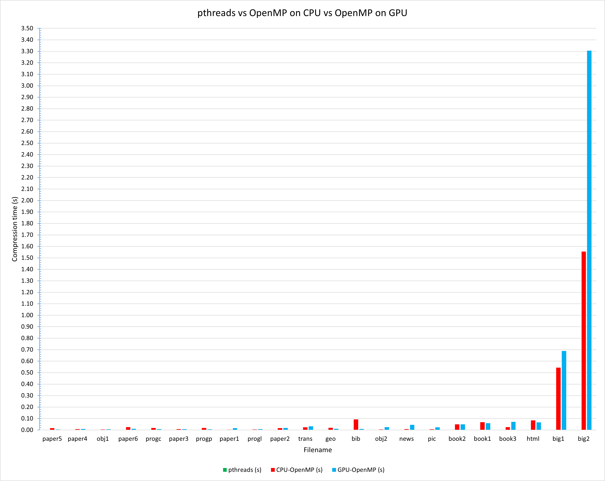

# DREAM Parallel LZO Compression

As a part of the DREAM project titled "Parallelization of data compression on different parallel processing systems" we have implemented LZO compression algorithm on POSIX threads. The project is done under the guidance of Associate Professor Dr. A. Özsoy at the Department of Computer Engineering, Middle East Technical University, Ankara, Turkey.

## LZO Compression Algorithm

LZO is a data compression algorithm that is focused on decompression speed. It is similar to the LZ77 algorithm published by Abraham Lempel and Jacob Ziv in 1977, and features a high decompression speed at the cost of a compression ratio that is lower than that of algorithms with a slower decompression speed. LZO is distributed under the GNU General Public License.

## LZO Compression Algorithm Implementation

The LZO compression algorithm is implemented using POSIX threads. The implementation is done in C programming language. The implementation is done in two ways:

1. Using a single thread
2. Using multiple threads

In this project, we aimed to increase the compression speed by using multiple threads. The implementation is done using 8 and 10 threads. The compression and decompression times are measured for each of the thread counts.

We plan to use systems such as CUDA and OpenMP to see the effect of using multiple threads on the compression speed in the future.

## Results and Analysis

### Using 8 Threads

| File Name | Original Size (in bytes) | Single Threaded LZO Compression Time (in seconds) | Multi Threaded LZO Compression Time (in seconds) |
| --------- | ------------------------ | ------------------------------------------------- | ------------------------------------------------ |
| paper5    | 11954                    | 0.000071                                          | 0.000598                                         |
| paper4    | 13286                    | 0.000178                                          | 0.001128                                         |
| obj1      | 21504                    | 0.000073                                          | 0.000621                                         |
| paper6    | 38105                    | 0.00017                                           | 0.000211                                         |
| progc     | 39611                    | 0.000176                                          | 0.000344                                         |
| paper3    | 46526                    | 0.00065                                           | 0.000762                                         |
| progp     | 49379                    | 0.000195                                          | 0.000476                                         |
| paper1    | 53161                    | 0.000291                                          | 0.000252                                         |
| progl     | 71646                    | 0.000246                                          | 0.000223                                         |
| paper2    | 82199                    | 0.000547                                          | 0.000271                                         |
| trans     | 93695                    | 0.001005                                          | 0.001001                                         |
| geo       | 102400                   | 0.000082                                          | 0.000555                                         |
| bib       | 111261                   | 0.0005                                            | 0.000204                                         |
| obj2      | 246814                   | 0.00094                                           | 0.000239                                         |
| news      | 377109                   | 0.003766                                          | 0.000351                                         |
| pic       | 513216                   | 0.000846                                          | 0.000207                                         |
| book2     | 610856                   | 0.002747                                          | 0.000227                                         |
| book1     | 768771                   | 0.005904                                          | 0.000215                                         |

### Using 10 Threads

| File Name | Original Size (in bytes) | Single Threaded LZO Compression Time (in seconds) | Multi Threaded LZO Compression Time (in seconds) |
| --------- | ------------------------ | ------------------------------------------------- | ------------------------------------------------ |
| paper5    | 11954                    | 0.000062                                          | 0.000819                                         |
| paper4    | 13286                    | 0.000197                                          | 0.001698                                         |
| obj1      | 21504                    | 0.000067                                          | 0.000941                                         |
| paper6    | 38105                    | 0.000158                                          | 0.000504                                         |
| progc     | 39611                    | 0.000165                                          | 0.001039                                         |
| paper3    | 46526                    | 0.000746                                          | 0.001287                                         |
| progp     | 49379                    | 0.000165                                          | 0.000414                                         |
| paper1    | 53161                    | 0.000323                                          | 0.000696                                         |
| progl     | 71646                    | 0.000244                                          | 0.000604                                         |
| paper2    | 82199                    | 0.000518                                          | 0.000351                                         |
| trans     | 93695                    | 0.000994                                          | 0.002757                                         |
| geo       | 102400                   | 0.000124                                          | 0.001139                                         |
| bib       | 111261                   | 0.000464                                          | 0.000286                                         |
| obj2      | 246814                   | 0.001241                                          | 0.000353                                         |
| news      | 377109                   | 0.003562                                          | 0.000413                                         |
| pic       | 513216                   | 0.000727                                          | 0.000409                                         |
| book2     | 610856                   | 0.002632                                          | 0.000308                                         |
| book1     | 768771                   | 0.005099                                          | 0.000286                                         |

### Overall Compression Time Comparison

As it can be seen in the graph below, there is a significant decrease in the compression time of bigger files when using multiple threads. However, for smaller files, the compression time is higher when using multiple threads. This is because the overhead of creating and joining threads is higher than the time saved by using multiple threads. Therefore, it is not beneficial to use multiple threads for smaller files. There is, on average, a 2.3x decrease in the compression time when using multiple threads.



### To Run the Code

1. Clone the repository
2. Install LZO library
3. Run the following commands in the directory where the repository is cloned

```
gcc -o pcompress pcompress.c -llzo2 -lpthread
./pcompress
```

#### Note

To change the number of threads, change the value of the thread_count variable in the code. The default value is 8.
